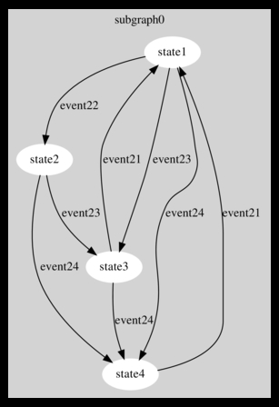

#poc-fsm

##proof-of-concept finite state machine

A Finite State Machine (FSM) implementation in ANSI C and a code generation utility to construct the relevant .c and .h files needed to drive the described FSM.

The representation of the states and the transitions between them is represented in a .gv, .tex or .yml file for easy modification of your FSM.

The .tex file is a totaly valid .tex document, and if you compile it by hand ( `pdflatex filename.tex` ) then you should have a .pdf file of your FSM showing the states and the transition between them, although it will be messy if you don't layout it by hand.

The most convinient way to produce a graphical representation of your FSM is by describing it in a .gv file with the DOT language and then produce the visual output with the following command:

`dot -Tps example_fsm.gv -o example_fsm.ps`

This will generate a postscript file that you can display with any modern document viewer (e.g: Atril).

**(read the <u>'Future Work may be'</u> section number 2, for very important info about the last/final state of your FSM)**

For the shipped example FSM see one of the attached .gv, .tex or .yml files.

The sample FSM has four states. The initial state is 'state1' and the transitions are as follows:

  * From 'state1' you can go to 'state2', 'state3' and 'state4'.
  * From 'state2' you can go to 'state3' and 'state4'.
  * From 'state3' you can go to 'state1' and 'state4'
  * From 'state4' you can go to 'state1'

A visual representation is the following:

***

***

<u>**Currently Supported Features:**</u>

 1. Representation of the FSM in a .gv, .tex or .yml file.
 2. Parsing of the .gv, .tex files and generation of a .yml file.
 3. Parsing of the .yml file and generation of .h and one .c files.

The .h file contains the definitions to be used, such as prototype functions, and a custom defined type for the states representation. 

The .c file contains skeleton code to implement your FSM transitioning logic. One function per defined state is generated with some facilities as: logging of current triggered state and resulting state, a comment statement containig all possible next transitions that where declared valid from the specific state. 

The generated skeleton functions are named trigger_<STATE_NAME\>, e.g, trigger_STATE6( );

The generated files are stored on the 'code_gen' subfolder, relativelly from where the 'state_parser.rb' script is executed. You can change it by approprietally setting the ''FILE_GEN_DIR'' variable at the script's source.

<u>**Future work may be:**</u>

1. Currently the last state is represented in the .tex file with a line like: "%\path (state4) edge node {} (state4);". Leaving this line uncommented wouldn't make much sense at the generated pdf and also visualy destroys the final result, so leave it commented out until a better solution will be introduced if the future.

2. Find a better solution for the above (2.)

3. A states validity table. The rows holds the 'From' state and column holds the 'To' state. The library user should be able to call stateValidity[2][1] == 1 to check if the transition from 'state2' to 'state1' is a valid one. Be aware that the array might have stateValidity[2][1] == 1 and stateValidity[1][2] == 0 or stateValidity[2][2] == 1, all of which represents perfectly valid transitions for a FSM. 

Zero padding for the array should be optional and enabled by default to avoid confusion to the programmer.

<u>**Shipped examples:**</u>

The examples shiped with the project descibes a very simple FSM. Descriptions are provided at:

  * graphviz .gv file
  * Tex .tex file
  * Dia software .dia file (non-parsable)

<u>**Script usage and produced output**</u>

To effectively use the state_parser.rb script you have to have a valid graph representation in a .tex, .gv, or .yml file.

If you have a .yml file go directly to step 2.

  * Step 1:

Run `state_parser.rb' <states_file.gv>` if there are no parsing errors, then a .yml file is produced.

  * Step 2:

Having the .yml file, run the script as follows: `state_parser.rb <states_file.yml>`. On succesfull completion a directory named "states_file_GENERATED_CODE" will be created. In this directory three files will be present:

  * "states_file.c": containing one function per state, and commented next possible transitions.
  * "states_file.h": containing necessary definitions.
  *  "samplemain.c": a simple main file to run two transitions.

You can complile the files using the following command:

`gcc ./samplemain.c ./example_fsm.c ./example_fsm.h`

and test the graph by running the a.out executable.

**Notes**

To properly compile the .tex file into a .pdf you must have the 'pdflatex' command availiable and also the TikZ/pgf library.

To properly visualize the .gv file into a .ps file, you must have the 'dot' command availiable.
